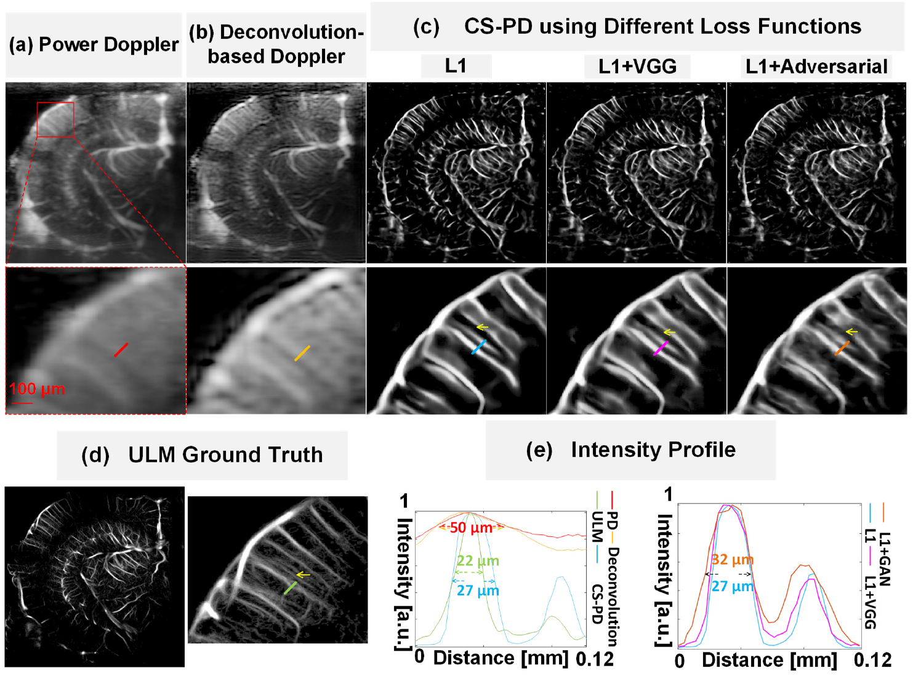
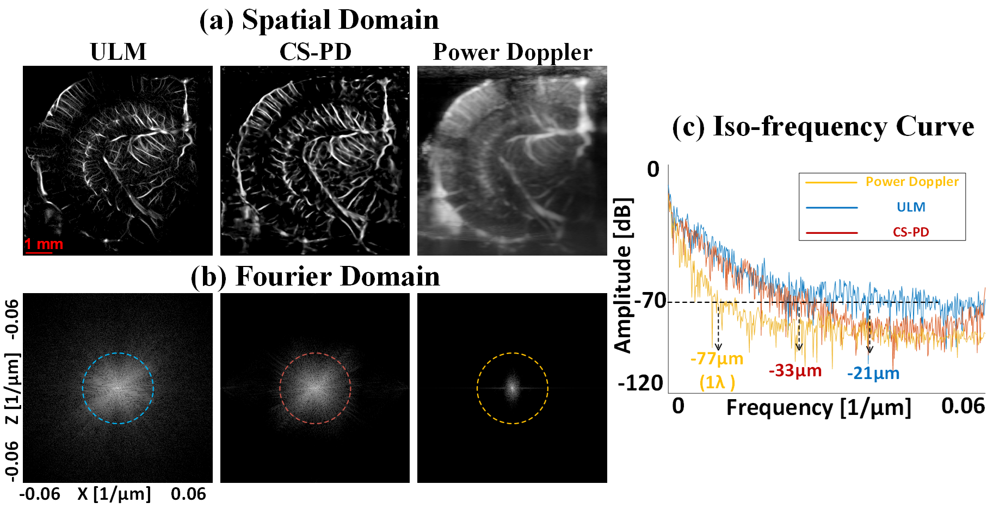
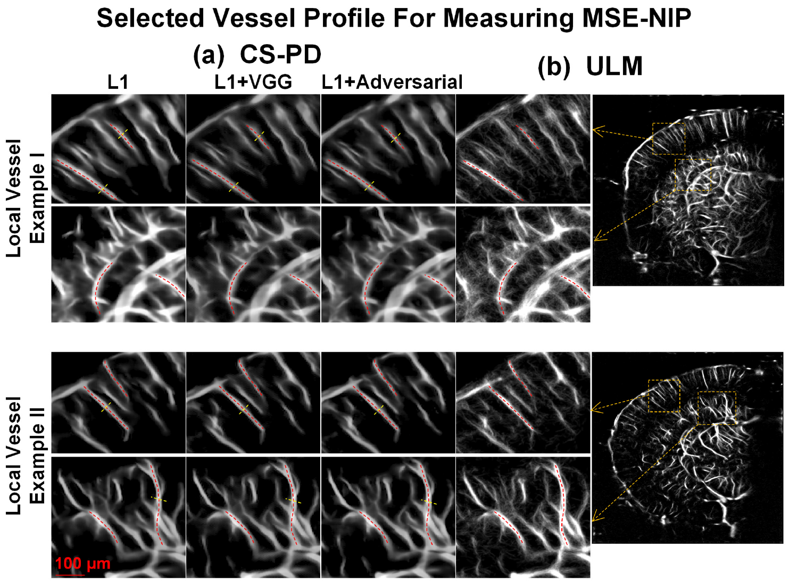

# [Contrast-free Super-resolution Doppler based on Deep Generative Neural Networks](https://www.biorxiv.org/content/10.1101/2022.09.29.510188v1.abstract)

# Result
- Conventional Power Doppler and CS Doppler
 

- Comparsion in Fourier Domain shows resolution is improved by 2-fold
 

- Comparsion of different test samples
 
